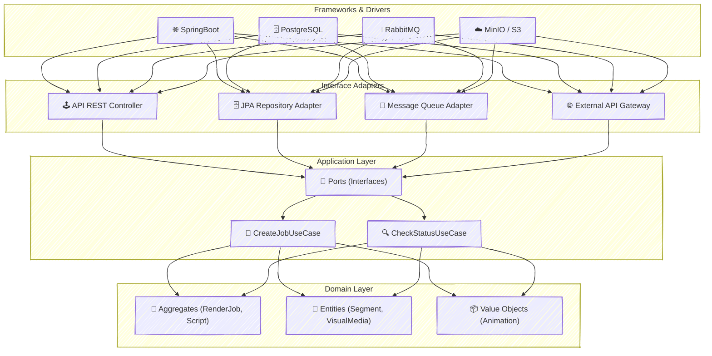
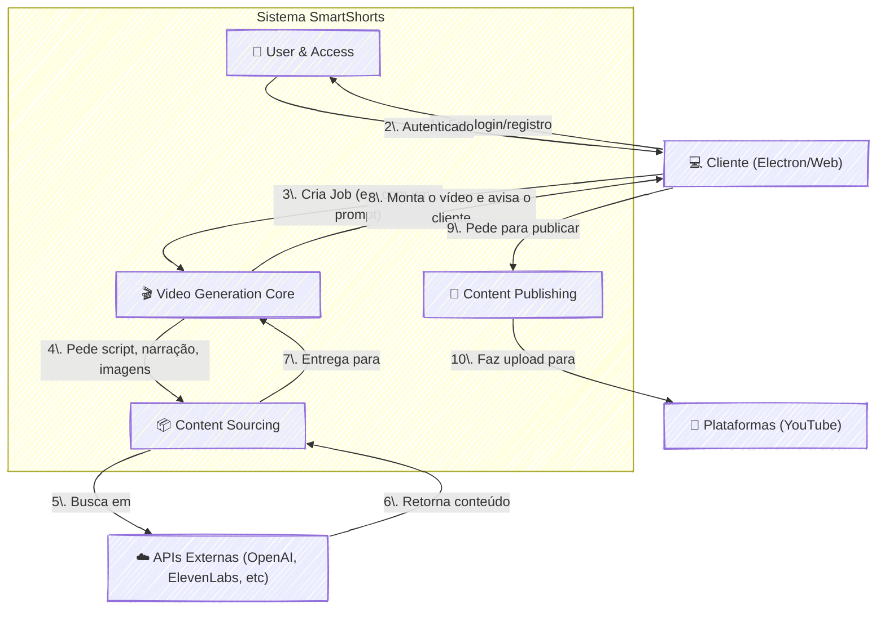

## **Documento de Arquitetura e Decisões Técnicas (ADR)**

**Projeto:** SaaS de Geração de Vídeos Automatizados
**Versão:** 3.1
**Data:** 14 de julho de 2025
**Status:** Consolidado e Revisado

**Histórico de Versões:**

  * **v1.0 (12/07/2025):** Versão inicial.
  * **v2.0 (12/07/2025):** Versão refinada com seções de negócio e riscos.
  * **v3.0 (14/07/2025):** Versão consolidada incorporando regras de negócio detalhadas, o modelo de domínio do projeto Python e revisões externas.
  * **v3.1 (21/07/2025):** Versão com nota sobre arquitetura Hexagonal
  * **v3.2 (28/07/2025):** Versão com 3.2.3. Contextos Delimitados (Bounded Contexts) Identificados

### 1\. Propósito e Escopo

Este documento centraliza as decisões de arquitetura, tecnologia e metodologia para o desenvolvimento do SaaS. Ele serve como a "fonte da verdade" para guiar a implementação, garantindo um desenvolvimento acelerado sem sacrificar qualidade, manutenibilidade e escalabilidade.

**Escopo:** O projeto abrange o desenvolvimento de um backend robusto em Java/Spring Boot, um cliente desktop inicial em Electron e a infraestrutura necessária para operar o serviço em nuvem.

### 2\. Filosofia e Contexto de Negócio

#### 2.1. Princípios Orientadores

  * **Domínio no Centro:** A lógica de negócio é o ativo mais valioso e deve ser independente de frameworks.
  * **Desenvolvimento Local, Deploy na Nuvem:** Ciclo de desenvolvimento rápido usando ferramentas locais (Docker).
  * **Comece Simples, Evolua com Segurança:** Arquitetura "Monolítica Modular" evoluindo para microserviços quando necessário.
  * **Qualidade por Design:** TDD integrado ao processo de desenvolvimento do core do sistema.
  * **API Contract-First:** O backend exporá um contrato OpenAPI (Swagger) versionado, garantindo estabilidade para os clientes.

#### 2.2. Contexto de Negócio

  * **Produto:** SaaS para geração automática de vídeos curtos e longos para redes sociais.
  * **Mercado Alvo:** Criadores de conteúdo, agências de marketing, influenciadores digitais.
  * **Modelo de Negócio:** *Subscription-based* (assinatura) com diferentes níveis (tiers) de funcionalidades e limites de uso.

### 3\. Arquitetura e Modelo de Desenvolvimento

#### 3.1. Padrão Arquitetural Principal

  * **Decisão:** **Clean Architecture**.
  * **Justificativa:** Separação clara de interesses, desacoplamento e alta testabilidade, facilitando a evolução e manutenção.Nossa implementação da Clean Architecture adere estritamente aos princípios da Arquitetura Hexagonal (Ports and Adapters), utilizando a separação entre o 'core' da aplicação e as tecnologias externas para garantir a independência do domínio e a intercambialidade da infraestrutura.

<!-- end list -->

#### 3.2. Abordagem de Modelagem de Domínio (DDD-Lite)

  * **Princípio da Unificação:** Não haverá distinção estrutural entre vídeos "curtos" e "longos". Um vídeo curto é um roteiro com um único segmento.
  * **Linguagem Ubíqua (em Inglês):**
      * **Agregados:** `RenderJob`, `Script`
      * **Entidades:** `Segment`, `VisualMedia`, `User`, `Subscription`
      * **Value Objects:** `Animation`, `TimeRange`
      * **Enums:** `JobStatus`, `MediaType`, `MovementType`

#### 3.2.1. Regras de Negócio Fundamentais

- **Verificação de Existência**: Todos os recursos (roteiros, narrações, imagens) são verificados antes da criação
- **Segmentação por Duração**: 
  - Short (≤8s): 1 segmento
  - Long (≤60s): múltiplos segmentos proporcionais
- **Múltiplas Fontes de Conteúdo**: Upload, APIs externas, geração em lote

#### 3.2.2. Estrutura de Dados Detalhada

**Script (Agregado):**
- `id`, `prompt_phrase`, `speech`, `duration`, `duration_seconds`
- `total_segments`, `created_at`, `scheduled_*_at`
- Lista de `Segment`

**Segment (Entidade):**
- `segment_id`, `time_begin`, `time_end`, `subtitle`
- `prompt_imagem`, `animation` (Movement + Vertical Offset)
- Referência para `VisualMedia`

#### 3.2.3. Contextos Delimitados (Bounded Contexts) Identificados

Para alinhar nossa arquitetura "Monolítica Modular" com uma futura evolução para microserviços e reforçar a separação de responsabilidades, identificamos os seguintes Bounded Contexts principais. Cada contexto possui sua própria linguagem e um conjunto coeso de responsabilidades.

**1. 🎬 Contexto de Geração de Vídeo (`Video Generation Core`)**
* **Descrição:** O coração do sistema, responsável por toda a lógica de negócio da criação e montagem de um vídeo.
* **Linguagem Principal:** `RenderJob`, `Script`, `Segment`, `Animation`, `TimeRange`, `JobStatus`, `MovementType`, `FFmpeg`.
* **Responsabilidades-Chave:**
    * Orquestrar o ciclo de vida de um `RenderJob`.
    * Combinar todos os ativos (imagens, áudios, legendas) em um arquivo de vídeo final (`AssembleVideo`).
    * Gerenciar a estrutura de `Scripts` e seus `Segments`.
* **Potencial de Evolução:** Permanece como o `core` do sistema. Tarefas pesadas (`AssembleVideo`) podem ser delegadas a *workers* especializados.

**2. 👤 Contexto de Usuários e Acesso (`User & Access Management`)**
* **Descrição:** Gerencia a identidade, autenticação, autorização e os dados de assinatura dos usuários.
* **Linguagem Principal:** `User`, `Subscription`, `JWT`, `PasswordEncoder`.
* **Responsabilidades-Chave:**
    * Autenticação e autorização via Spring Security + JWT.
    * Controle de acesso baseado em papéis (RBAC).
    * Gerenciamento de dados de usuários e suas assinaturas.
* **Potencial de Evolução:** Principal candidato a ser extraído como um microserviço de `Identidade/Pagamentos`, conforme planejado na Fase 3.

**3. 📦 Contexto de Aquisição de Conteúdo (`Content Sourcing`)**
* **Descrição:** Atua como um gateway para obter os "ingredientes" brutos para a criação do vídeo a partir de fontes externas.
* **Linguagem Principal:** `ScriptGeneratorPort`, `AudioGeneratorPort`, `ImageGeneratorPort`, `OpenAI`, `ElevenLabs`, `Replicate`, `Pixabay`.
* **Responsabilidades-Chave:**
    * Implementar os adaptadores para as APIs externas confirmadas.
    * Gerar roteiros a partir de prompts (`CreateRenderJobFromPrompt`).
    * Gerar narrações para lotes de roteiros (`GenerateNarrationBatch`).
    * Isolar o `core` das falhas em serviços externos, usando padrões como Circuit Breaker.
* **Potencial de Evolução:** Pode ser decomposto em *workers* ou funções serverless menores para cada integração específica, facilitando a troca de provedores.

**4. 📢 Contexto de Publicação (`Content Publishing`)**
* **Descrição:** Responsável por entregar o vídeo finalizado para as plataformas de destino e gerenciar seu agendamento.
* **Linguagem Principal:** `PublishVideo`, `SchedulePublication`, `VideoPlatformPublisherPort`, `YouTube API`.
* **Responsabilidades-Chave:**
    * Realizar o upload do vídeo final para plataformas externas (`PublishVideo`).
    * Agendar uma data/hora futura para a publicação (`SchedulePublication`).
* **Potencial de Evolução:** Pode se tornar um microserviço de "Distribuição", lidando com as particularidades de cada plataforma social.
  
O diagrama abaixo ilustra como esses contextos interagem dentro do sistema SmartShorts:

#### 3.3. Casos de Uso Principais (Aplicação)

| Caso de Uso | Descrição |
| :--- | :--- |
| `CreateRenderJobFromPrompt` | Inicia um job, gerando um novo roteiro a partir de um prompt de texto. |
| `CreateRenderJobFromJsonUpload` | Inicia um job a partir de um arquivo de roteiro (JSON) enviado pelo usuário. |
| `CheckJobStatus` | Retorna o status atual de um job. |
| `AddBackgroundMusic` | Adiciona uma trilha sonora a um job existente. |
| `GenerateSubtitles` | Gera as legendas para a narração de um job. |
| `AssembleVideo` | Combina todos os ativos (imagens, áudios, legendas) em um arquivo de vídeo final. |
| `PublishVideo` | Realiza o upload do vídeo final para uma plataforma externa (ex: YouTube). |
| `SchedulePublication` | Agenda uma data/hora futura para a publicação do vídeo. |
| `GenerateNarrationBatch` | (Processo offline) Gera narrações para um lote de roteiros. |

#### 3.4. Estratégia de Desenvolvimento e Testes

  * **Decisão:** **Test-Driven Development (TDD) Focado no Core**.
  * **Plano de Testes em Camadas:**
    1.  **Testes Unitários (TDD):** Domínio e Casos de Uso (JUnit 5, Mockito).
    2.  **Testes de Integração:** Adaptadores de Interface (Testcontainers para Postgres/Redis, WireMock para APIs externas).
    3.  **Testes de Ponta a Ponta (E2E):** Controllers da API.

### 4\. Stack de Tecnologia

  * **Backend:** **Java 17+ e Spring Boot 3+**.
  * **Dependências Iniciais:** Spring Web, Data JPA, Security, PostgreSQL Driver, Lombok, Actuator, AMQP.
  * **Persistência:** **PostgreSQL** (Relacional), **MinIO/S3** (Objetos), **Redis** (Cache e Filas de Jobs).
  * **Comunicação Externa:** **Spring WebClient**.

#### 4.1. Processamento Assíncrono - Decisão Híbrida

| Opção | Pontuação | Fase de Uso | Comentários |
| :--- | :--- | :--- | :--- |
| **Spring `@Async`** | 9/10 | **MVP (Fase 1)** | Implementação rápida para validação do fluxo. |
| **RabbitMQ** | 10/10 | **Produção (Fase 2+)** | Solução robusta para escalabilidade e resiliência. |
**Decisão:** Iniciar com `@Async` e evoluir para RabbitMQ, usando interfaces para facilitar a troca.

#### 4.2. Estratégia de Fallback para Python

  * **Observação Estratégica:** Enquanto certas integrações (ex: Whisper) não possuem SDKs Java maduros, será permitido que *workers* Python especializados executem essas tarefas, comunicando-se com o core Java via Fila de Mensagens ou API REST.

#### 4.3. Integrações Externas Confirmadas

- **OpenAI**: Geração de roteiros
- **ElevenLabs**: Síntese de voz
- **Replicate/Pixabay**: Geração de imagens
- **FFmpeg**: Processamento de vídeo

### 5\. Segurança e Resiliência

  * **Autenticação e Autorização:** **Spring Security + JWT** para autenticação stateless e controle de acesso baseado em papéis (RBAC).
  * **Proteção de APIs Externas:** Padrão **Circuit Breaker** com **Resilience4j** para isolar falhas, com políticas de *retry* e *fallback*.

### 6\. Monitoramento e Observabilidade

  * **Decisão:** **Spring Boot Actuator + Micrometer** para exposição de métricas.
  * **Métricas Essenciais:**
      * Tempo de processamento de vídeo por job.
      * Taxa de sucesso/falha dos jobs (por tipo de erro).
      * Latência das APIs externas (OpenAI, ElevenLabs, etc.).
      * Uso de recursos da JVM (heap, threads).
  * **Visão Futura:** Coleta centralizada de logs (ELK Stack) e métricas (Prometheus/Grafana).

### 7\. Infraestrutura e DevOps

  * **Ambiente de Desenvolvimento:** **Docker + Docker Compose** para simular a infraestrutura de produção localmente (Postgres, RabbitMQ, MinIO, Redis).
  * **Estratégia de Deploy Evolutiva:**
    1.  **Fase 1:** Monolito em contêiner Docker.
    2.  **Fase 2:** Uso de serviços gerenciados na nuvem (AWS RDS, S3, etc.).
    3.  **Fase 3:** Extração de microserviços baseada em critérios objetivos.

### 8\. Estratégia de Frontend

  * **Cliente principal:** Web App responsiva (React/Vue).
  * **Cliente MVP:** **Electron**, com mockups de UI definidos antes da implementação.

### 9\. Plano de Implementação em Fases (Alto Nível)

  * **Fase 1 - MVP (30 dias):**
      * Refatoração do Domínio (Script, Segment).
      * Implementação do fluxo principal de criação de vídeo (prompt -\> vídeo final).
      * API REST para os casos de uso principais.
      * Processamento assíncrono com `@Async`.
      * Integração com as APIs externas essenciais (OpenAI, ElevenLabs, Gerador de Imagem).
      * Validação dos critérios de aceitação do MVP.
  * **Fase 2 - Produção (60 dias):**
      * Sistema de autenticação com JWT.
      * Migração do processamento para RabbitMQ.
      * Monitoramento completo e pipeline de CI/CD.
      * Ambiente de homologação (Staging) e testes de carga.
  * **Fase 3 - Escala (90 dias):**
      * Início da extração do microserviço de `Pagamentos`.
      * Sistema de planos e assinaturas.
      * Desenvolvimento do Web App.

### 10\. Riscos e Mitigações

| Risco | Probabilidade | Impacto | Mitigação |
| :--- | :--- | :--- | :--- |
| Dependência de APIs externas | Alta | Alto | Circuit Breaker, fallbacks, abstração para múltiplos provedores. |
| Processamento de vídeo lento | Média | Médio | Otimização de parâmetros FFmpeg, paralelização de tarefas. |
| Mudanças de custo em APIs | Média | Alto | Monitoramento de custos, abstração para facilitar troca de provedor. |

### 11\. Critérios de Aceitação

  * **Técnicos:**
      * Tempo médio de resposta da API \< 200ms.
      * Cobertura de testes unitários do core (domínio/aplicação) \> 85%.
      * Disponibilidade do serviço \> 99.5%.
  * **De Negócio:**
      * Usuário consegue gerar um vídeo completo a partir de um prompt em menos de 5 minutos.
      * Interface intuitiva (validada via mockups na Fase 1).
      * Suporte aos formatos de vídeo verticais (9:16).

-----

### Resumo das Principais Mudanças na Versão 3.0

  * **Modelo de Domínio Unificado:** Incorporamos sua ideia de tratar vídeos curtos como roteiros de um único segmento. O `Script` foi promovido a Agregado e a entidade `Segment` foi introduzida, refletindo a estrutura do projeto Python (`Atualização da ADR-v2 B.md`).
  * **Linguagem Ubíqua Expandida:** A lista de termos foi atualizada para incluir `Segment`, `Animation`, `MovementType`, etc., tornando-a mais completa (`Rev Plano Impl. Claude.md`, `Atualização da ADR-v2 A.md`).
  * **Casos de Uso Completos:** A tabela de casos de uso agora inclui os fluxos de upload e geração em lote, que foram identificados na sua lista de regras de negócio (`Atualização da ADR-v2 A.md`).
  * **Critérios de Aceitação Detalhados:** A seção foi substituída por critérios mais específicos e mensuráveis, conforme sugerido na revisão (`Rev Plano Impl. Claude.md`).
  * **Infraestrutura com Redis:** O Docker Compose e a stack de persistência agora incluem explicitamente o Redis, um ponto levantado na revisão (`Rev Plano Impl. Claude.md`).
  * **Priorização de Contratos:** A filosofia "API Contract-First" foi reforçada, alinhando-se às melhores práticas sugeridas (`Rev Plano Impl. Claude.md`, `Rev Plano Impl. Gpt4.md`).
